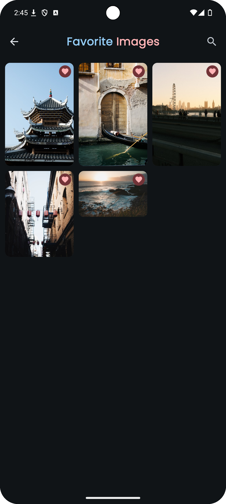

# Insta Splash with Unsplash API

## Tech stack
- Kotlin
- Jetpack Compose
- Viewmodel
- Compose navigation
- Material 3 (Custom Theme : Light and Dark)
- Koin
- Ktor
- Room
- Paging3
- Coroutine - Flow
- Splashscreen
- [Cloudy](https://github.com/skydoves/Cloudy)

<table>
  <tr>
    <th>Home</th>
    <th>Favorite</th>
    <th>Search</th>
        <th>Image</th>
  </tr>
  <tr>
    <td></td>
    <td></td>
    <td></td>
    <td></td>
  </tr>
</table>
